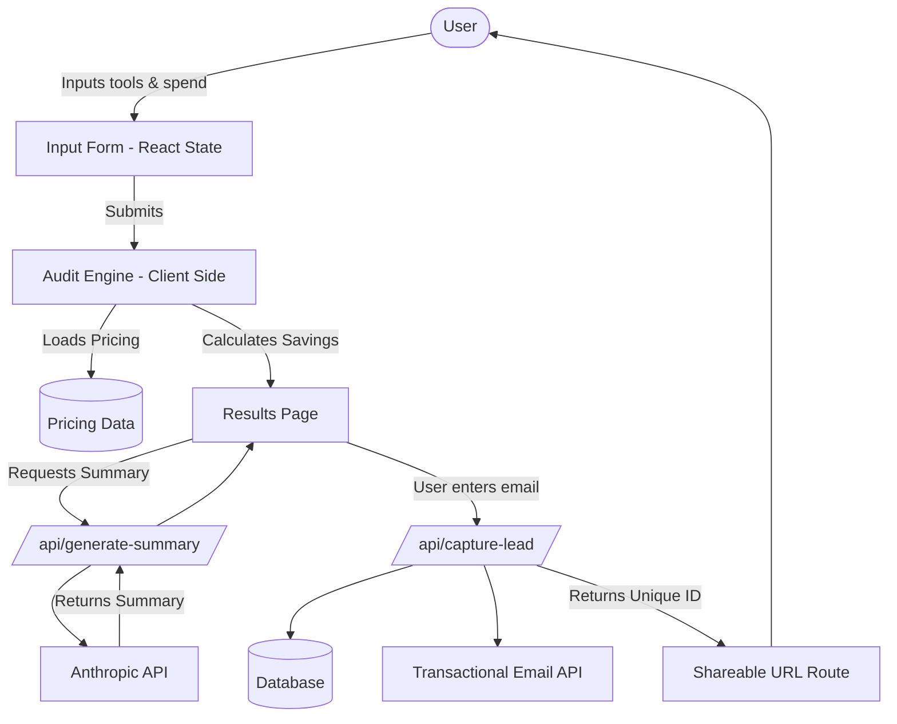

# Architecture

## Stack Justification
**Next.js (React) + TypeScript + Tailwind CSS**
- Next.js provides the App Router for seamless frontend/backend integration in one repo.
- TypeScript ensures type safety for pricing models and tool configurations.
- Tailwind CSS allows for rapid, premium styling of the UI without separate CSS files.

## System Diagram

## Data Flow
1. User lands on the page and fills out the dynamic form with their AI tools, seats, and spend.
2. The Audit Engine evaluates these inputs against the hardcoded `PRICING_DATA` logic to determine potential savings.
3. The Results page displays the breakdown. If savings >$500/mo, a lead capture form is prominently displayed.
4. Upon submitting the lead capture form, an API route is called which:
   a. Saves the lead and audit results to the database.
   b. Triggers a transactional email.
   c. Generates a unique, anonymized shareable URL.
5. The page requests a personalized summary from the LLM via another secure API route.

## Scale Considerations
If handling 10k audits/day:
- The audit engine is client-side, so it scales perfectly.
- Database writes (lead capture) would need connection pooling (e.g., Supabase Prisma/PgBouncer) or edge functions to prevent DB overload.
- LLM API limits (Anthropic/OpenAI) would be the bottleneck. We would need heavy caching for identical tool configurations or a queueing system to prevent rate limit errors.
